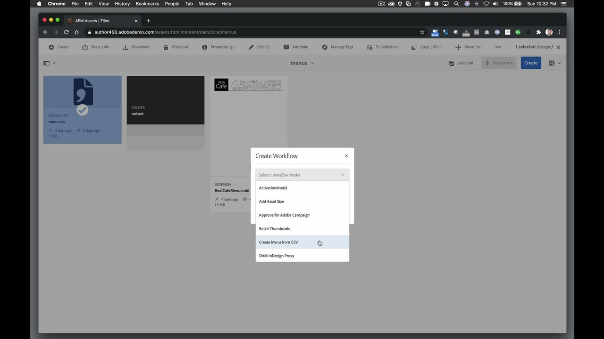
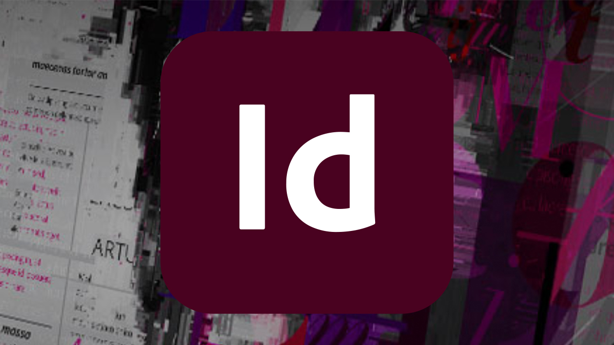

# InDesign Server

Adobe Adobe® InDesign® Server  software delivers a robust and scalable engine that leverages the design, layout, and typographical capabilities of InDesign to let you programmatically create engaging automated documents.

## Browse Product Tutorials

<table>
<tr>
 <td>
   
    

   <a href="indesignserver.md#tutorial1"><strong>Data-Driven InDesign Server Content</strong></a>
    

    <em>Data-driven design can be achieved, programatically, with InDesign Server</em>
     
  </td>
  <td>
    
    

     
  </td>
  <td>
    
    

     
  </td>
</tr>
</table>

## Data-Driven InDesign Server Content (4:14) {#tutorial1}

>[!VIDEO](https://video.tv.adobe.com/v/326901?hidetitle=true)

**Description**
Data-driven design can be achieved, programatically, with InDesign Server. 

In this tutorial, you will learn how to:
* Create InDesign templates with pre-formatted text or object styles
* Flow in external data driven content for faster personalization of content
* Generate spot-on PDFs, or tie into other AEM driven output formats, of your layout

**Presented by:**
Eric Rowse, Senior Solutions Consultant (Digital Media)

## Additional InDesign Server Resources

<table>
<tr>
 <td>
   
    

   <a href="https://www.adobe.com/products/indesignserver/buying-guide.html"><strong>InDesign Server: Buying Guide</strong></a>
    

    <em>Resources available for in house developers or partners</em>
     
  </td>
  <td>
   
    

   <a href="https://www.adobe.com/products/indesignserver/partner.html"><strong>InDesign Server: Find a Partner</strong></a>
    

    <em>While you have the expertise to develop in house, Adobe recommends working with partners to find the solution to meet your requirements</em>
     
  </td>
  <td>
    
    

     
  </td>
</tr>
</table>

**InDesign Server Resources**

[Learn & Support](https://www.adobe.com/products/indesignserver.html) is your hub for additional tutorials, What’s New, and links to community forums.

**October 2020 Release**

Start using these features (and more!) by downloading the latest update from your Creative Cloud Desktop App.