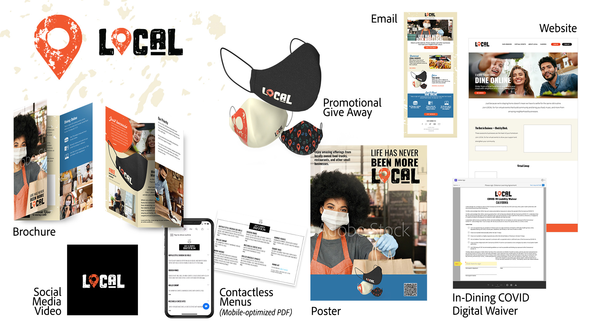

# MAX 2020 — the Enterprise Sessions

As an enterprise creative, you need to collaborate with distributed teams, establish scalable processes, and comply with corporate systems and guidelines. These tutorials will help you learn new features in the 2021 release of Creative Cloud—from an enterprise perspective. 

## Operate at Scale—Leverage the power of AEM Assets and InDesign Server (26:54)

>[!VIDEO](https://video.tv.adobe.com/v/327112?hidetitle=true)

**Description**

Is your creative staff spending too much time on manual, repetitive work? Help your organization get the most out of creative professionals. Enterprise systems like AEM and InDesign Server can provide both creative and production personnel means of rapidly pushing content into the hands of your target audience.

In this recorded live session, you’ll see examples of template-based workflows in:  
* Adobe Experience Manager (AEM) Assets is a digital asset management (DAM) solution that can integrate with Adobe Creative Cloud to help DAM users work together with creative teams, streamlining collaboration in the content creation process
* Adobe InDesign Server is a layout and composition engine that powers automated publishing solutions by integrating into other systems

**Presented by:**

Eric Rowse, Senior Solutions Consultant (Digital Media)
Derek Lu, Principal Solutions Consultant (Proof of Concept)

## New tools for the new normal (29:57)

>[!VIDEO](https://video.tv.adobe.com/v/328232?hidetitle=true)

**Description**

WFH has brought challenges, but it has also compelled creatives and their companies to experiment with new tools and new ways to create. Explore familiar tools like Illustrator and Photoshop in their new iPad versions and draw with Fresco on tablets (iPad, Microsoft Surface) and now on iPhone!

In this recorded live session, you will learn how to:
* Use various brushes and shading techniques in Fresco to create hand-drawn campaign artwork
* Create and share distressed icons in Illustrator on iPad to match branding
* Composite artwork from Fresco and Illustrator on iPad to create content for our social media channels, while on the go with Photoshop on iPad
     
**Presented by:**

Dave Weinberg, Senior Solutions Consultant (Digital Media)
Liz Tanonis, Solutions Consultant (Digital Media)
Emilie Enke, Solutions Consultant (Digital Media)

## Collaboration with CC Libraries (27:58)

>[!VIDEO](https://video.tv.adobe.com/v/328199?hidetitle=true)

**Description**

With Adobe Creative Cloud Libraries you can manage, organize, and access your logos, colors, and more directly from your favorite Creative Cloud apps. Work more efficiently, ensure creative consistency, and easily stay in sync with your team. 

In this tutorial, you will learn how to:
* Find the assets you need easily within all of your creative applications
* Empower communicators throughout your organization to create on-brand experiences, while still maintaining control
     
**Presented by:**

Ashley Dvorin, Senior Solutions Consultant (Digital Media)
Emily Palmer, Solutions Consultant (Digital Media)

## About the Demo Assets: LOCAL

The team approached creating the demo assets as an enterprise might. We envisioned a campaign and created assets for various channels. We also created a CC Library of brand elements to support collaboration and consistency. 

In response to COVID-19, LOCAL, a company that hosts live events that celebrate fun, wacky holidays has pivoted to online gatherings and is partnering with small, local food trucks and restaurants to promote their businesses—and help them stay open.

