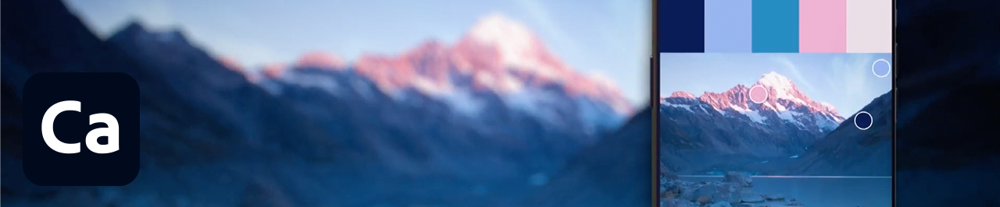
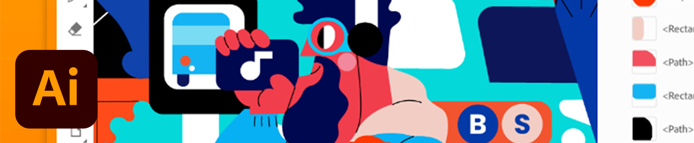
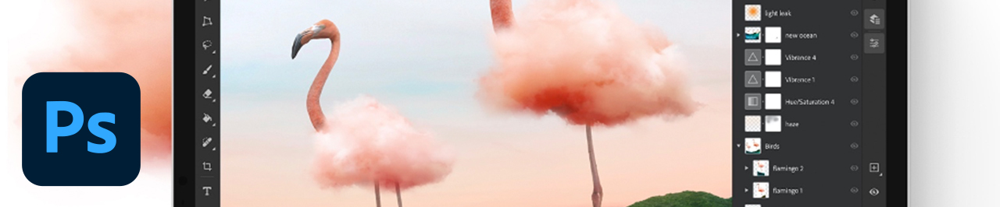
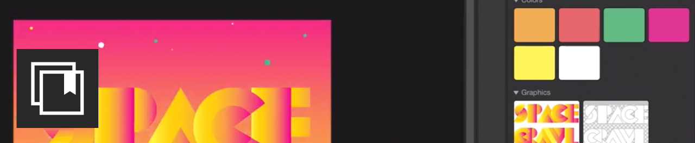

# Tutorials

As an enterprise creative, you need to collaborate with distributed teams, establish scalable processes, and comply with corporate systems and guidelines. These tutorials will help you learn new features in the 2021 release of Creative Cloud—from an enterprise perspective. 

## Tutorials by Desktop Products

<table>
<tr>
 <td>
    
    

    <a href="acrobat-sign.md"><strong>Acrobat & Adobe Sign</strong></a>
    

    <em>Create, edit, and sign PDF documents and forms</em>
     
  </td>
  <td>
    
    

    <a href="dimension.md"><strong>Dimension</strong></a>
    

    <em>Create photorealistic 3D images for branding, product shots, and package design</em>
     
  </td>
  <td>
    
    

    <a href="illustrator.md"><strong>Illustrator</strong></a>
    

    <em>Vector graphics and illustration</em>
     
  </td>
</tr>
<tr>
 <td>
    
    

    <a href="indesign.md"><strong>InDesign</strong></a>
    

    <em>Page design and layout for print and digital publishing</em>
     
  </td>
  <td>
    
    

    <a href="photoshop.md"><strong>Photoshop</strong></a>
    

    <em>Edit, composite, and create beautiful images, graphics, and art on desktop</em>
     
  </td>
  <td>
    
    

    <a href="rush.md"><strong>Rush</strong></a>
    

    <em>Create and share online videos anywhere</em>
     
  </td>
</tr>
<tr>
 <td>
    
    

    <a href="xd.md"><strong>XD</strong></a>
    

    <em>Design, prototype, and share user experiences</em>
     
  </td>
  <td>
    
    

     
  </td>
  <td>
    
    

     
  </td>
</tr>
</table>

### Tutorials by Mobile App

<table>
<tr>
 <td>
    
    

    <a href="capture.md"><strong>Capture</strong></a>
    

    <em>Turn any image into a color theme, vector graphic, brush, and more</em>
     
  </td>
  <td>
    
    

    <a href="fresco.md"><strong>Fresco</strong></a>
    

    <em>Rediscover the joy of drawing and painting anywhere</em>
     
  </td>
  <td>
    
    

    <a href="illustratoripad.md"><strong>Illustrator on iPad</strong></a>
    

    <em>Vector graphics and illustration</em>
     
  </td>
</tr>
<tr>
 <td>
    
    

    <a href="photoshopipad.md"><strong>Photoshop on iPad</strong></a>
    

    <em>Edit, composite, and create beautiful images, graphics, and art on desktop and iPad</em>
     
  </td>
  <td>
    
    

     
  </td>
  <td>
    
    

     
  </td>
</tr>
</table>

### Tutorials by Integration

<table>
<tr>
 <td>
    
    

    <a href="aem.md"><strong>AEM Assets & Asset Link</strong></a>
    

    <em>Next generation digital asset management</em>
     
  </td>
  <td>
    
    

    <a href="creativeclouddesktopapp.md"><strong>Creative Cloud Desktop App</strong></a>
    

    <em>The Creative Cloud desktop app is your hub for managing CC apps, services, and collaboration—and more!</em>
     
  </td>
  <td>
    
    

    <a href="cclibraries.md"><strong>CC Libraries</strong></a>
    

    <em>Keep your assets on hand and your projects on brand</em>
     
  </td>
</tr>
<tr>
<td>
    
    

    <a href="indesignserver.md"><strong>InDesign Server</strong></a>
    

    <em>The sophisticated tools of InDesign paired with customized automation</em>
     
  </td>
 <td>
    
    

    <a href="stock.md"><strong>Adobe Stock</strong></a>
    

    <em>High-quality digital images, illustrations, videos, audio, templates and more</em>
     
  </td>
  <td>
    
    

     
  </td>
</tr>
</table>

### Hands-on Project: Create your own Face Mask

<table>
<tr>
 <td>
    
    

    <a href="handsonproject.md"><strong>Create your own Face Mask</strong></a>
    

    <em>With the Adobe Design to Print plug-in, you can visualize your designs on hundreds of Zazzle products, and publish directly to their online marketplace</em>
     
  </td>
  <td>
    
    

     
  </td>
  <td>
    
    

     
  </td>
</tr>
</table>