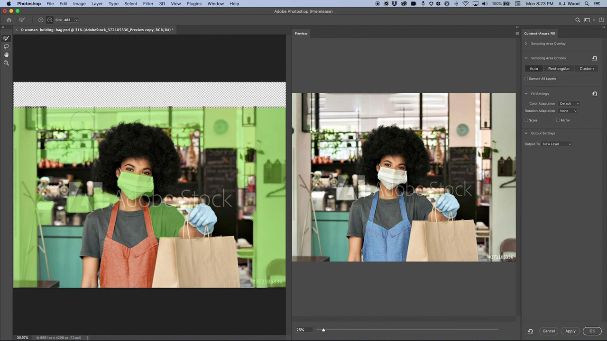
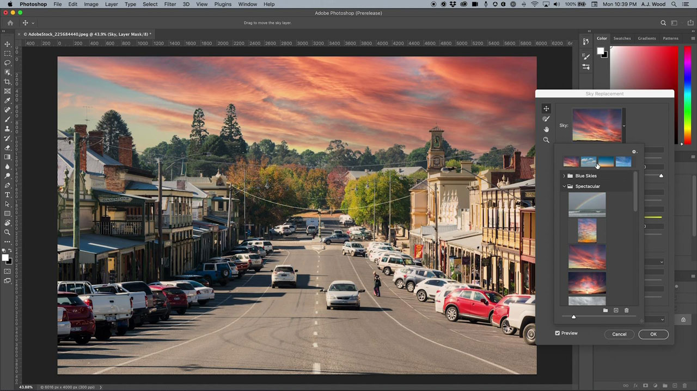

# Photoshop

Photoshop is the world’s best imaging and graphic design software, allowing unlimited creativity for professionals across devices. Now anyone can create anything they imagine, anywhere inspiration strikes. If you can think it, you can make it with Photoshop.

## Browse Product Tutorials

<table>
<tr>
 <td>
   
    

   <a href="photoshop.md#tutorial1"><strong>Edit Images to Match your Campaign</strong></a>
    

    <em>Use the powerful selection and color editing tools in Adobe Photoshop to dramatically change an image to match your corporate branding needs</em>
     
  </td>
  <td>
    
    

    <a href="photoshop.md#tutorial2"><strong>Select and Replace the Sky</strong></a>
    

    <em>Automatically select the sky in an image and replace with a sky of your choice, auto-adjusting the colors of the image to match your selection</em>
     
  </td>
  <td>
    
    

     
  </td>
</tr>
</table>

## Edit Images to Match your Campaign (5:45) {#tutorial1}

>[!VIDEO](https://video.tv.adobe.com/v/326950?hidetitle=true)

**Description**
Use the powerful selection and color editing tools in Adobe Photoshop to dramatically change an image to match your corporate branding needs.

In this tutorial, you will learn how to:
* The Object Selection Tool makes selecting items faster and simpler
* Content-Aware Fill allows more control of sample areas within a source image for better cloning and patching of target areas
* Brushes can be different shapes for better results
* Adobe Sensei helps leverage artificial intelligence for mundane tasks

**Presented by:**
A.J Wood, Senior Solutions Consultant (Digital Media)

## Select and Replace the Sky (2:16) {#tutorial2}

>[!VIDEO](https://video.tv.adobe.com/v/326953?hidetitle=true)

**Description**
Automatically select the sky in an image and replace with a sky of your choice, auto-adjusting the colors of the image to match your selection.

In this tutorial, you will learn how to:
* Sky Replacement provides a one-click solution to instantly swap skies in your images
* Sky Replacement saves its output as a layer group with every mask, adjustment and image for further refinement

**Presented by:**
A.J Wood, Senior Solutions Consultant (Digital Media)

**Photoshop Resources**

[Learn & Support](https://helpx.adobe.com/support/photoshop.html) is your hub for additional tutorials, [What’s New](https://helpx.adobe.com/photoshop/using/whats-new.html), and links to community forums.

**October 2020 Release**

Start using these features (and more!) by downloading the latest update from your Creative Cloud Desktop App.