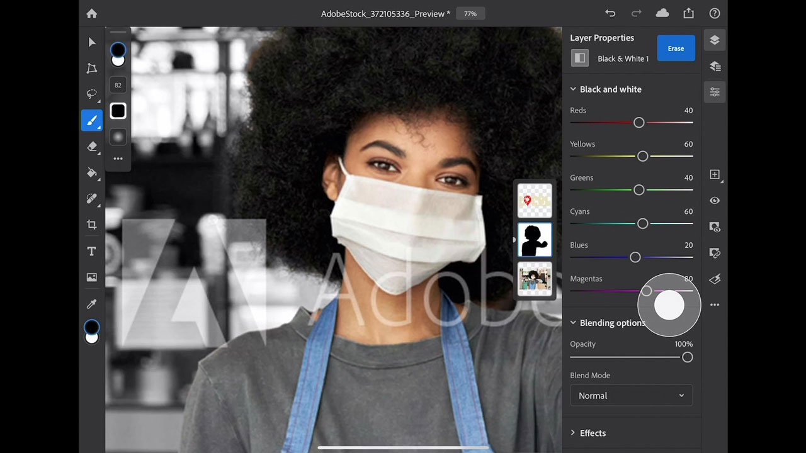
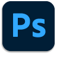

# Photoshop on iPad

Photoshop is the world’s best imaging and graphic design software, allowing unlimited creativity for professionals across devices. Now anyone can create anything they imagine, anywhere inspiration strikes. If you can think it, you can make it with Photoshop.

## Browse Product Tutorials

<table>
<tr>
 <td>
   
    

   <a href="photoshopipad.md#tutorial1"><strong>Intro to Photoshop on the iPad</strong></a>
    

    <em>Take an interface tour and learn a few features found in Photoshop reimagined for use on the Apple iPad</em>
     
  </td>
  <td>
    
    

     
  </td>
  <td>
    
    

     
  </td>
</tr>
</table>

## Intro to Photoshop on the iPad (5:14) {#tutorial1}

>[!VIDEO](https://video.tv.adobe.com/v/326899?hidetitle=true)

**Description**
Take an interface tour and learn a few features found in Photoshop reimagined for use on the Apple iPad. 

In this tutorial, you will learn how to:
* Access your favorite Photoshop tools on the 
* Precise editing on mobile without sacrificing quality
* More immersive and natural experience
* Seamless workflow with Cloud Docs

**Presented by:**
Dan Armstrong, Solutions Consultant (Digital Media)

**Photoshop on the iPad Resources**

[Learn & Support](https://helpx.adobe.com/support/photoshop.html) is your hub for additional tutorials and links to community forums.

**October 2020 Release**

Start using these features (and more!) by downloading the latest update from your Creative Cloud Desktop App.