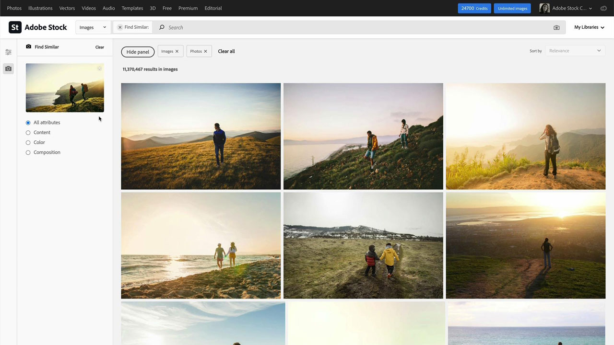

# Stock

Creatives  are  under  pressure  to  quickly  deliver  new, visually compelling content  that  will  capture and hold attention. Adobe Stock for enterprise gives creative teams access to over 200 million images, videos, templates, illustrations, audio files and 3D assets – all from within the Adobe creative apps they use every day.

## Browse Product Tutorials

<table>
<tr>
 <td>
   
    

   <a href="stock.md#tutorial1"><strong>Find the best assets faster with Adobe Stock</strong></a>
    

    <em>Find the perfect royalty-free stock image to enhance your creative project using better, faster search results powered by Adobe Sensei, our artificial intelligence engine</em>
     
  </td>
  <td>
   
    

   <a href="stock.md#tutorial2"><strong>Search and License Stock Assets in 
Adobe Experience Manager</strong></a>
    

    <em>Simplify the process of uploading your licensed Adobe Stock assets into your Digital Asset Management system</em>
     
  </td>
  <td>
    
    

     
  </td>
</tr>
</table>

## Find the best assets faster with Adobe Stock (10:49) {#tutorial1}

>[!VIDEO](https://video.tv.adobe.com/v/326951?hidetitle=true)

**Description**
Find the perfect royalty-free stock image to enhance your creative project using better, faster search results powered by Adobe Sensei, our artificial intelligence engine.

In this tutorial, you will learn how to:
* Take the time and stress out of your search for high-quality images and video
* Easily manage and track asset licenses and usage across your enterprise
* Search, preview, and license right inside of your Adobe Creative Cloud Apps

**Presented by:**

Victoria Torres, Stock Solutions Consultant (Digital Media)

## Search and License Stock Assets in AEM (6:46) {#tutorial2}

>[!VIDEO](https://video.tv.adobe.com/v/326952?hidetitle=true)

**Description**
Simplify the process of uploading your licensed Adobe Stock assets into your Digital Asset Management system.

In this tutorial, you will learn how to:
* Perform Adobe Stock asset search without leaving AEM workspace
* Save licensed assets directly to an AEM folder at time of licensing
* View assets licensed from AEM in your Stock license history on the Stock website. 

**Presented by:**
Emily Palmer, Solutions Consultant (Digital Media)

**Adobe Stock Resources**

[Learn & Support](https://helpx.adobe.com/support/stock.html) is your hub for additional tutorials and links to community forums.

**October 2020 Release**

Start using these features (and more!) by downloading the latest update from your Creative Cloud Desktop App.