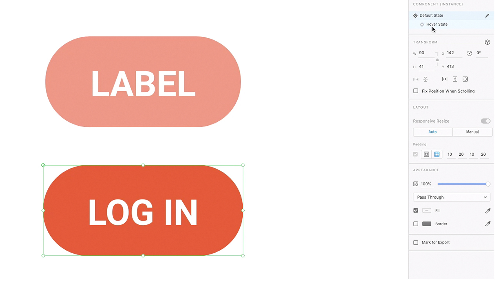
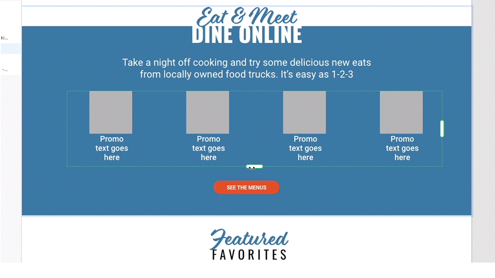
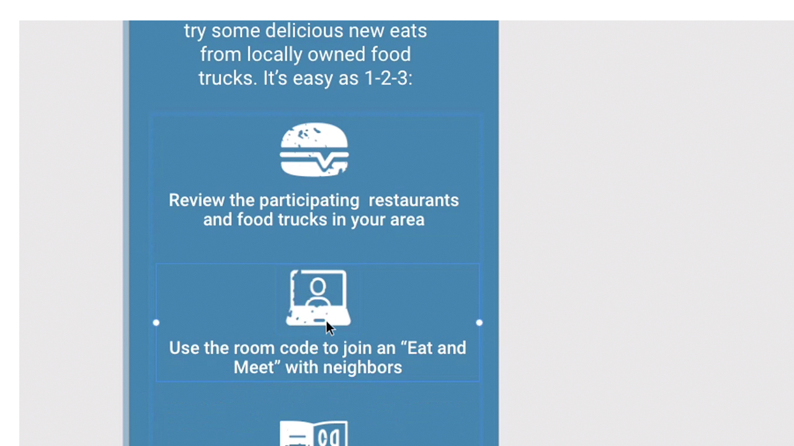
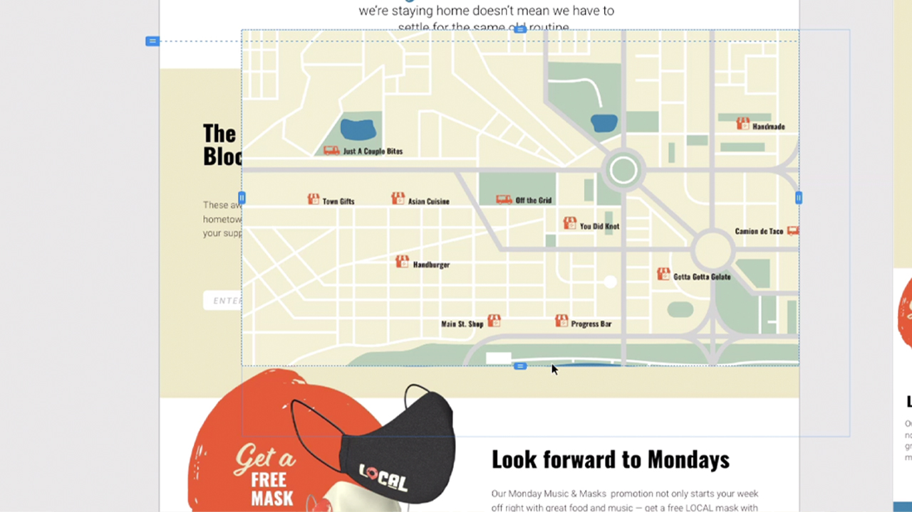
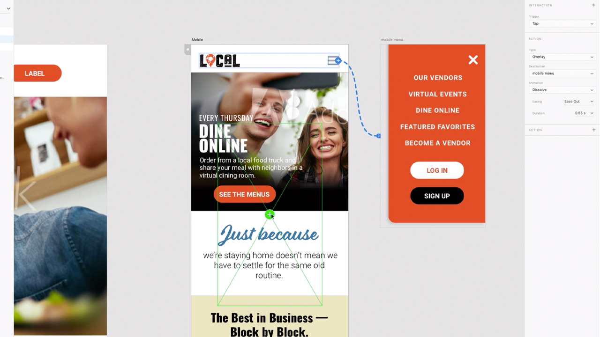
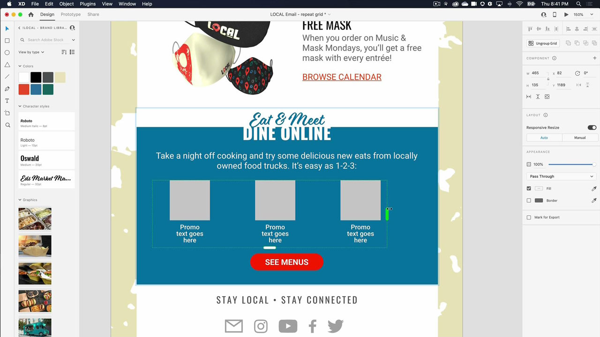
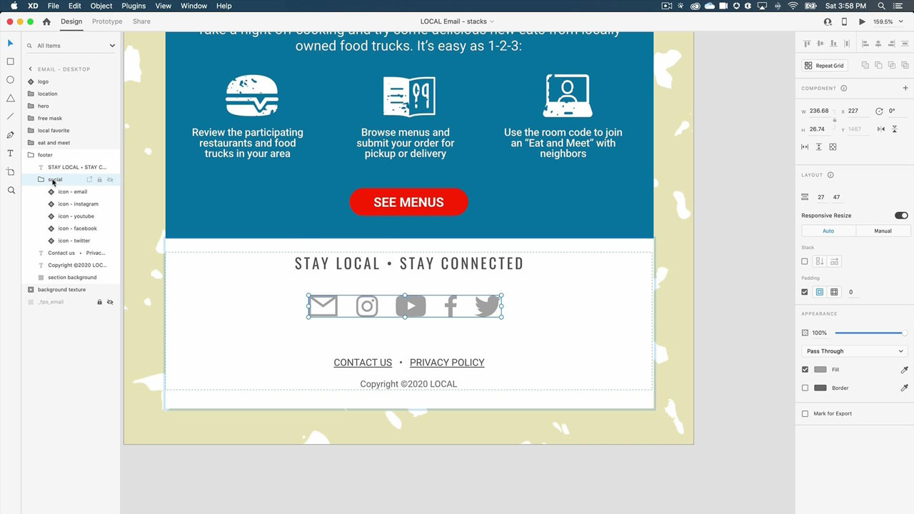

# XD

Adobe XD is a user experience design and prototyping tool for designing websites, apps, voice interfaces, games, and other types of digital experiences.

## Browse Product Tutorials

<table>
<tr>
 <td>
   
    

   <a href="xd.md#tutorial1"><strong>Create Components with Hover States</strong></a>
    

    <em>Create reusable, dynamically resizable, buttons for your interactive designs</em>
     
  </td>
  <td>
    
    

    <a href="xd.md#tutorial2"><strong>Create and Populate a Repeat Grid</strong></a>
    

    <em>Turn a single element into repeating grids with a simple click-and-drag</em>
     
  </td>
  <td>
   
    

    <a href="xd.md#tutorial3"><strong>Work with Stacks</strong></a>
    

    <em>Use the stack property to easily rearrange elements</em>
     
  </td>
</tr>
<tr>
 <td>
    
    

    <a href="xd.md#tutorial4"><strong>Create a Prototype—Anchor Links and 
Scroll Groups</strong></a>
    

    <em>Add navigation and scrolling to a prototype</em>
     
  </td>
  <td>
    
    

    <a href="xd.md#tutorial5"><strong>Create a Prototype—Interactive Component States</strong></a>
    

    <em>Add interactivity and an overlay menu to a prototype</em>
     
  </td>
  <td>
   
    

   <a href="xd.md#tutorial7"><strong>Email - Create and Populate a Repeat Grid</strong></a>
    

    <em>Turn a single element into repeating grids with a simple click-and-drag</em>
     
  </td>
</tr>
<tr>
 <td>
    
    

    <a href="xd.md#tutorial7"><strong>Email - Work with Stacks</strong></a>
    

    <em>Use the stack property to easily rearrange elements</em>
     
  </td>
  <td>
    
    

     
  </td>
  <td>
    
    

     
  </td>
</tr>
</table>

## Create Components with Hover States (7:35) {#tutorial1}

>[!VIDEO](https://video.tv.adobe.com/v/326874?hidetitle=true)

**Description**
Create reusable, dynamically resizable, buttons for your interactive designs.

In this tutorial, you will learn how to:
* Make changes to a source main component and those changes are pushed automatically to all instances of that component
* Use components for consistency, time saving, fewer clicks

**Presented by:**
Michael Murphy, Senior Solutions Consultant (Digital Media)

## Create and Populate a Repeat Grid (2:57) {#tutorial2}

>[!VIDEO](https://video.tv.adobe.com/v/326955?hidetitle=true)

**Description**
Turn a single element into repeating grids with a simple click-and-drag.

In this tutorial, you will learn how to:
* Boost your workflow and drag out any sized grid you need, instantly
* Bring in real content and data and XD will magically place all images and text to your grid
* Make changes once and apply it where you like, in any direction

**Presented by:**
Ashley Dvorin, Senior Solutions Consultant (Digital Media)

## Work with Stacks (5:33) {#tutorial3}

>[!VIDEO](https://video.tv.adobe.com/v/326956?hidetitle=true)

**Description**
Use the stack property to easily rearrange elements.

In this tutorial, you will learn how to:
* Maintain alignment and spacing between objects on your canvas even as your design changes
* Insert new objects or reorder objects in a stack and everything adjusts automatically

**Presented by:**
Michael Murphy, Senior Solutions Consultant (Digital Media)

## Create a Prototype—Anchor Links and Scroll Groups (9:55) {#tutorial4}

>[!VIDEO](https://video.tv.adobe.com/v/326957?hidetitle=true)

**Description**
Add navigation and scrolling to a prototype.

In this tutorial, you will learn how to:
* Add links to your prototypes with an action that lets users jump to different points on the same artboard  
* Create activity feeds, image carousels, product listings, and more by defining areas that scroll independently from the rest of your designs
* Create groups that scroll vertically, horizontally, or both

**Presented by:** 
Michael Murphy, Senior Solutions Consultant (Digital Media)

## Create a Prototype—Interactive Component States (8:55) {#tutorial5}

>[!VIDEO](https://video.tv.adobe.com/v/326958?hidetitle=true)

**Description**
Add interactivity and an overlay menu to a prototype.

In this tutorial, you will learn how to:
* Create a non-linear interactive and animated user experience without the need for additional artboards
* Author multiple prototype or interaction flows in a single XD document and publish unique shareable links for each flow

**Presented by:**
Emilie Enke, Associate Solutions Consultant (Digital Media)

## Email - Create and Populate a Repeat Grid (4:45) {#tutorial6}

>[!VIDEO](https://video.tv.adobe.com/v/326775?hidetitle=true)

**Description**
Turn a single element into repeating grids with a simple click-and-drag.

In this tutorial, you will learn how to:
* Boost your workflow and drag out any sized grid you need, instantly
* Bring in real content and data and XD will magically place all images and text to your grid
* Make changes once and apply it where you like, in any direction

**Presented by:**
Victoria Torres, Solutions Consultant (Digital Media)

## Email - Work with Stacks (3:38) {#tutorial7}

>[!VIDEO](https://video.tv.adobe.com/v/326759?hidetitle=true)

**Description**
Use the stack property to easily rearrange elements.

In this tutorial, you will learn how to:
* Maintain alignment and spacing between objects on your canvas even as your design changes
* Insert new objects or reorder objects in a stack and everything adjusts automatically

**Presented by:**
 Victoria Torres, Solutions Consultant (Digital Media)

 

**XD Resources**

[Learn & Support](https://helpx.adobe.com/support/xd.html) is your hub for additional tutorials, [What’s New](https://helpx.adobe.com/xd/user-guide.html/xd/help/whats-new.ug.html), and links to community forums.

**October 2020 Release**

Start using these features (and more!) by downloading the latest update from your Creative Cloud Desktop App.