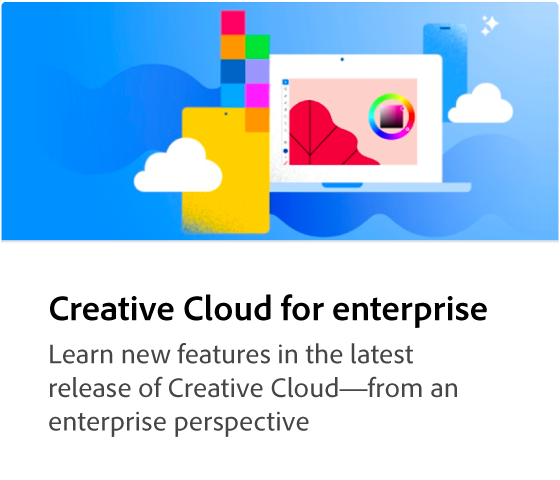
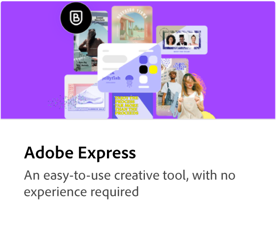
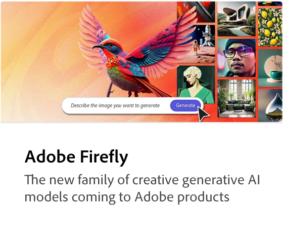
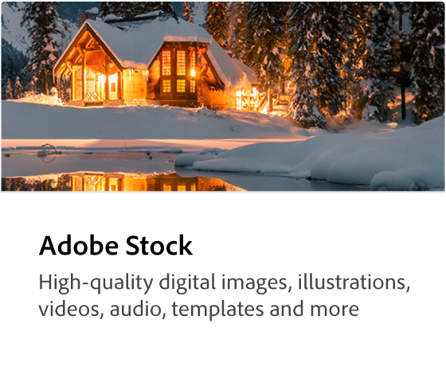
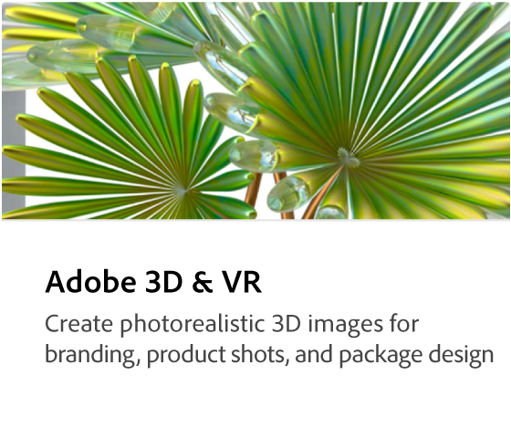
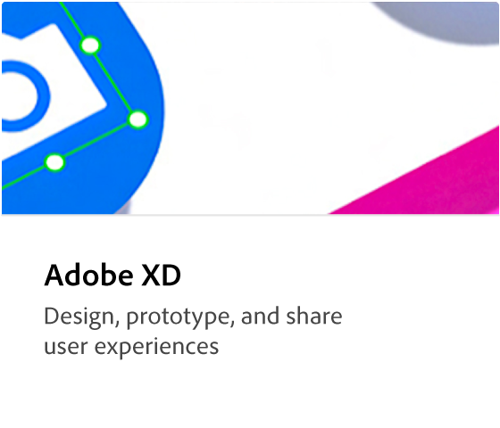
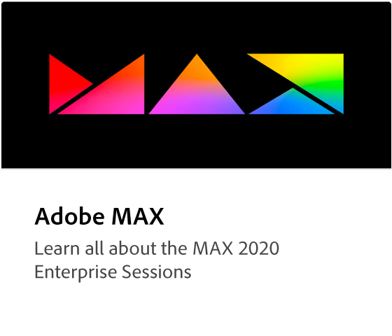

# Creative Cloud for enterprise tutorials

Welcome to the Creative Cloud for enterprise learning hub. Here you can find a wide range of learning experiences focused on Creative Cloud for enterprise. Our tutorials, webinars, and use cases are designed to quickly bring both beginners and administrators up-to-speed on the Creative Cloud for enterprise products.

## Browse topics

<!-- COMMENT -->
<!-- CARDS

* https://experienceleague.adobe.com/en/docs/creative-cloud-enterprise-learn/cce-learning-hub/cceoverview/overview-cce
  {target = _self}
  {title = Creative Cloud for enterprise tutorials}
  {description = Learn new features in the latest release of Creative Cloud—from an enterprise perspective}
  {image = https://experienceleague.adobe.com/en/docs/creative-cloud-enterprise-learn/cce-learning-hub/media_16d0b4bc8d977366abc857846ccb13e98d0dbdcba.png?width=400&format=webply&optimize=medium}
  {cta = Browse tutorials}
* https://experienceleague.adobe.com/en/docs/creative-cloud-enterprise-learn/cce-learning-hub/expressoverview/expresshowto/overview-express-how-to
  {target = _self}
  {title = Adobe Express}
  {description = Get started creating amazing work that stands out}
  {image = https://experienceleague.adobe.com/en/docs/creative-cloud-enterprise-learn/cce-learning-hub/media_147ff2adb3b6666e184b73e7d7a2f3ba7870e2e2d.png?width=400&format=webply&optimize=medium}
  {cta = Browse tutorials}
* https://experienceleague.adobe.com/en/docs/creative-cloud-enterprise-learn/cce-learning-hub/fireflyoverview/overview-firefly
  {target = _self}
  {title = Adobe Firefly}
  {description = Family of creative generative AI models in Adobe products}
  {image = https://experienceleague.adobe.com/en/docs/creative-cloud-enterprise-learn/cce-learning-hub/media_1ef57758ab48c616d77f2a64a42dd64d7089aade5.png?width=400&format=webply&optimize=medium}
  {cta = Browse tutorials}
* https://experienceleague.adobe.com/en/docs/creative-cloud-enterprise-learn/cce-learning-hub/stockoverview/overview-stock
  {target = _self}
  {title = Adobe Stock}
  {description = High-quality digital images, illustrations, video, audio, templates, and more}
  {image = https://experienceleague.adobe.com/en/docs/creative-cloud-enterprise-learn/cce-learning-hub/media_1269d469351bf3a67311794f9b3dce2e0b342429e.png?width=400&format=webply&optimize=medium}
  {cta = Browse tutorials}
* https://experienceleague.adobe.com/en/docs/creative-cloud-enterprise-learn/cce-learning-hub/3doverview/overview-3di
  {target = _self}
  {title = Adobe 3D & VR}
  {description = Create photorealistic 3D images for branding, product shots, and package design}
  {image = https://experienceleague.adobe.com/en/docs/creative-cloud-enterprise-learn/cce-learning-hub/media_18e961b58ea0fc7210e7aed113da2b2f69a23d0d4.png?width=400&format=webply&optimize=medium}
  {cta = Browse tutorials}
* https://experienceleague.adobe.com/en/docs/creative-cloud-enterprise-learn/cce-learning-hub/videooverview/overview-dva
  {target = _self}
  {title = Adobe Video}
  {description = Bring your ideas to life with apps for video editing, motion graphics, visual affects, animation, and more}
  {https://experienceleague.adobe.com/en/docs/creative-cloud-enterprise-learn/cce-learning-hub/media_1b94f0eb740d3be825f3f8db916c0703c432d9ed5.png?width=400&format=webply&optimize=medium}
  {cta = Browse tutorials}
* https://experienceleague.adobe.com/en/docs/creative-cloud-enterprise-learn/cce-learning-hub/xdoverview/overview-xd
  {target = _self}
  {title = Adobe XD}
  {description = Design, prototype, and share user experiences}
  {https://experienceleague.adobe.com/en/docs/creative-cloud-enterprise-learn/cce-learning-hub/media_1022a51440d87ff4ad9ffe56d79d0aa6f0b8dee2d.png?width=400&format=webply&optimize=medium}
  {cta = Browse tutorials}
* https://experienceleague.adobe.com/en/docs/creative-cloud-enterprise-learn/cce-learning-hub/max/overview-max
  {target = _self}
  {title = Adobe MAX}
  {description = Learn all about the MAX 2020 enterprise sessions}
  {https://experienceleague.adobe.com/en/docs/creative-cloud-enterprise-learn/cce-learning-hub/media_123d1f364e7b955b6abb56e8708e22f080254474d.png?width=400&format=webply&optimize=medium}
  {cta = Browse tutorials}
  
-->
<!-- END CARDS -->
<!-- END COMMENT -->

<table style="table-layout:fixed">
<tr>
   <td>
      
      

          <a href="cce/overview-cce.md"><strong>Creative Cloud for enterprise tutorials</strong></a>
          

          <em>Learn new features in the latest release of Creative Cloud—from an enterprise perspective</em>
           
   </td>
   <td>
      
      

          <a href="express/overview-express.md"><strong>Adobe Express</strong></a>
          

          <em>Get started creating amazing content that stands out</em>
         
   </td>
   <td>
      
      

          <a href="firefly/overview-firefly.md"><strong>Firefly</strong></a>
          

          <em>Learn all about the generative AI models in Adobe products</em>
         
   </td>
   <td>
      
      

          <a href="stock/overview-stock.md"><strong>Adobe Stock</strong></a>
          

          <em>High-quality digital images, illustrations, video, audio, templates, and more</em>
         
   </td>
</tr>
<tr>
  <td>
      
      

          <a href="3di/overview-3di.md"><strong>Adobe 3D & VR</strong></a>
          

          <em>Create photorealistic 3D images for branding, product shots, and package design</em>
         
   </td>
   <td>
      
      

          <a href="dva/overview-dva.md"><strong>Adobe Video</strong></a>
          

          <em>Bring your ideas to life with video</em>
         
   </td>
   <td>
      
      

          <a href="xd/overview-xd.md"><strong>Adobe XD</strong></a>
          

          <em>Design, prototype, and share user experiences</em>
         
   </td>
    <td>
      
      

          <a href="max/overview-max.md"><strong>Adobe MAX</strong></a>
          

          <em>Learn all about the MAX 2020 enterprise sessions</em>
         
   </td>
</tr>
</table>