# Adobe Stock tutorials

Creatives are under pressure to quickly deliver new, visually compelling content that will capture and hold attention. Adobe Stock for enterprise gives creative teams access to over 200 million images, videos, templates, illustrations, audio files and 3D assets – all from within the Adobe creative apps they use every day.

## Click to view an Adobe Stock tutorial

<table>
<tr>
   <td>
      
      

      <a href="searchstock.md"><strong>Search Adobe Stock licensing history</strong></a>
      

      <em>Learn how to quickly search your organization's Adobe Stock licensing history in Creative Cloud for enterprise</em>
       
  </td>
  <td>
      
      

      <a href="handdrawn.md"><strong>Add a hand-drawn aesthetic to Adobe Stock images</strong></a>
      

      <em>Amp up your creative marketing with unique techniques that add depth and dimension to your imagery using Photoshop for iPad</em>
       
  </td>
  <td>
   
    

   <a href="flairtypography.md"><strong>Add flair to typography with masks and animation</strong></a>
    

    <em>Bring your text to life with elements from Adobe Stock and animation styles from After Effects</em>
     
  </td>
</tr>
<tr>
   <td>
      
      

      <a href="animatevector.md"><strong>Animate an Adobe Stock vector illustration in Photoshop</strong></a>
      

      <em>Bring animation into your newsletter graphics with editable vectors for Adobe Stock</em>
       
  </td>
   <td>
      
      

      <a href="annualreport.md"><strong>Begin Your Annual Report with a video created with Adobe Stock and Spark Video</strong></a>
      

      <em>Make your annual report a story with Adobe Stock and Spark Video</em>
       
  </td>
  <td>
      
      

      <a href="customanimations.md"><strong>Bring creative to life with custom animations by Adobe Stock</strong></a>
      

      <em>Use Adobe Stock images, textures, patterns to custom animations in Photoshop</em>
       
  </td>
</tr>
<tr>
   <td>
      
      

      <a href="changecolors.md"><strong>Change an Adobe Stock image’s colors to match your story</strong></a>
      

      <em>Find a unique photo in Adobe Stock and then adjust the color in Adobe Photoshop to fit your needs</em>
       
  </td>
  <td>
      <a href="collage.md">
         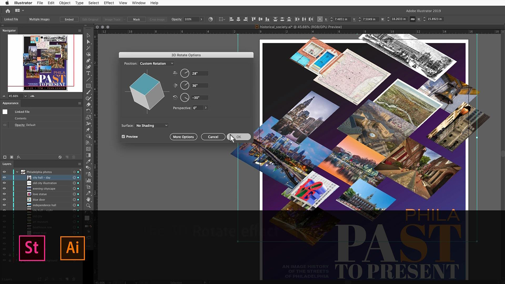
      </a>
      

      <a href="collage.md"><strong>Create a 3D collage for a poster using Adobe Stock images</strong></a>
      

      <em>Design a collage in Adobe Illustrator that features an eye-catching 3D effect from images in Adobe Stock</em>
       
  </td>
  <td>
      <a href="boldlabel.md">
         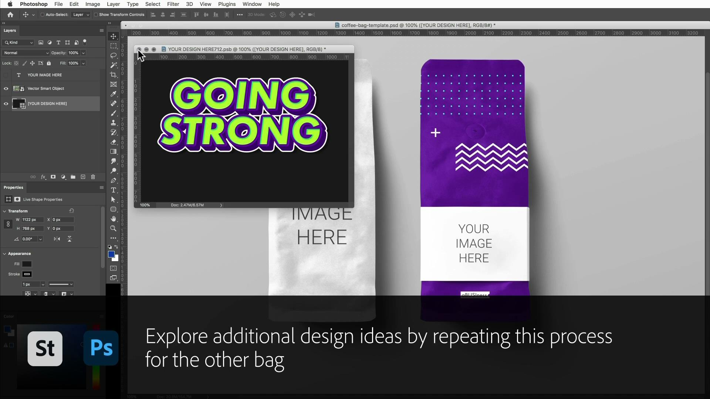
      </a>
      

      <a href="boldlabel.md"><strong>Create a bold label with Adobe Stock templates and Photoshop Smart Objects</strong></a>
      

      <em>Design and visualize your custom designs with realistic packaging templates from Adobe Stock</em>
       
  </td>
</tr>
<tr>
   <td>
      <a href="infographic.md">
         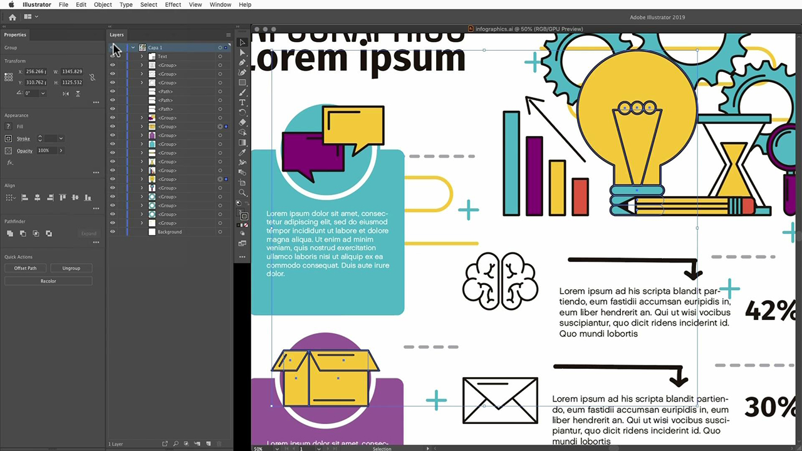
      </a>
      

      <a href="infographic.md"><strong>Create a company guidelines infographic with Adobe Stock</strong></a>
      

      <em>Combine a variety of assets from Adobe Stock to communicate guidelines in the form of visually compelling infographics</em>
       
  </td>
 <td>
      <a href="featurecomparison.md">
         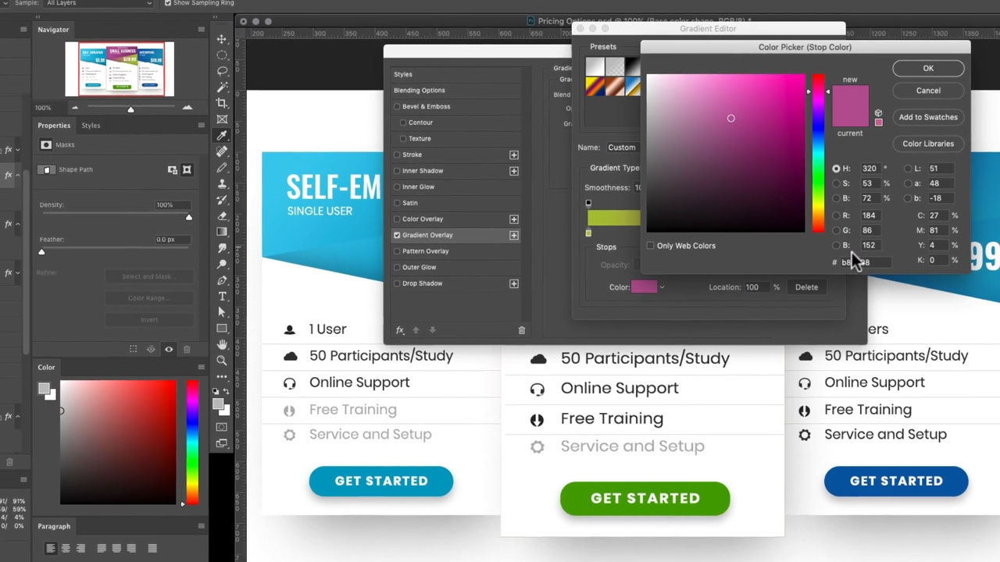
      </a>
      

      <a href="featurecomparison.md"><strong>Create a product feature comparison chart using Adobe Stock</strong></a>
      

      <em>Create a graphic that compares product pricing plans to give prospective customers the information they need at a glance</em>
       
  </td>
  <td>
      <a href="surrealcomposite.md">
         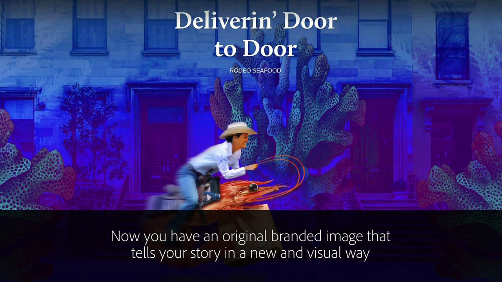
      </a>
      

      <a href="surrealcomposite.md"><strong>Create a semi-surreal composite with Adobe Stock</strong></a>
      

      <em>Create a memorable editorial image by combining multiple images with color, motion, and masking effects</em>
       
  </td>
</tr>
<tr>
   <td>
      <a href="surrealpattern.md">
         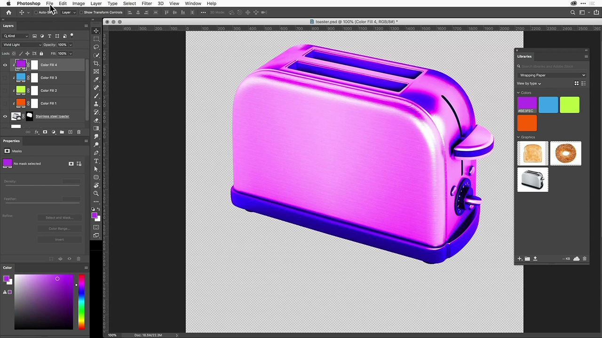
      </a>
      

      <a href="surrealpattern.md"><strong>Create a semi-surreal pattern with Adobe Stock</strong></a>
      

      <em>Create a beautiful seamless pattern based on surreal imagery from Adobe Stock</em>
       
  </td>
   <td>
      
      

      <a href="productconfigurator.md"><strong>Create an interactive product configurator with Adobe Stock</strong></a>
      

      <em>Use the power of interactivity, animation, and editable artwork from Adobe Stock to present financial information in a visual way</em>
       
  </td>
  <td>
      <a href="interactivetourismphoto.md">
         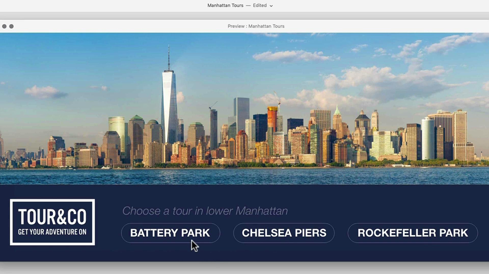
      </a>
      

      <a href="interactivetourismphoto.md"><strong>Create an interactive tourism photo with Adobe Stock and XD</strong></a>
      

      <em>Quickly create an interactive photo within your website prototype with Adobe Stock & XD</em>
       
  </td>
</tr>
<tr>
   <td>
      <a href="animationemail.md">
         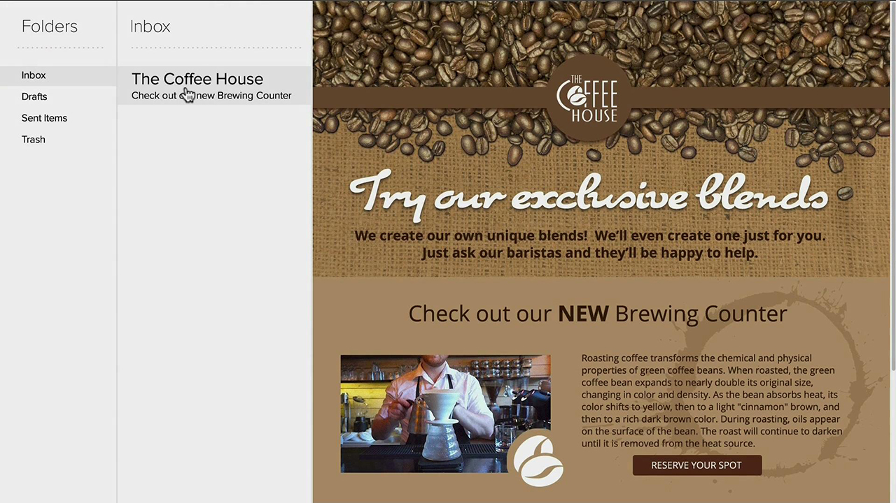
      </a>
      

      <a href="animationemail.md"><strong>Create animations for email with Adobe Stock and Photoshop</strong></a>
      

      <em>Empower your Emails with Stop-Action Animation with Adobe Stock and Photoshop</em>
       
  </td>
 <td>
      <a href="brandgradients.md">
         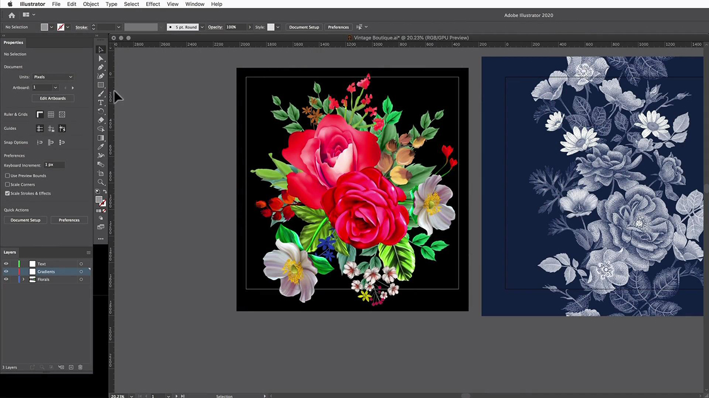
      </a>
      

      <a href="brandgradients.md"><strong>Create cohesive brand imagery with beautiful gradients and Adobe Stock assets</strong></a>
      

      <em>Create brand unity with varying images by combining colors and gradients across your advertising campaign</em>
       
   </td>
  <td>
      <a href="webgraphics.md">
         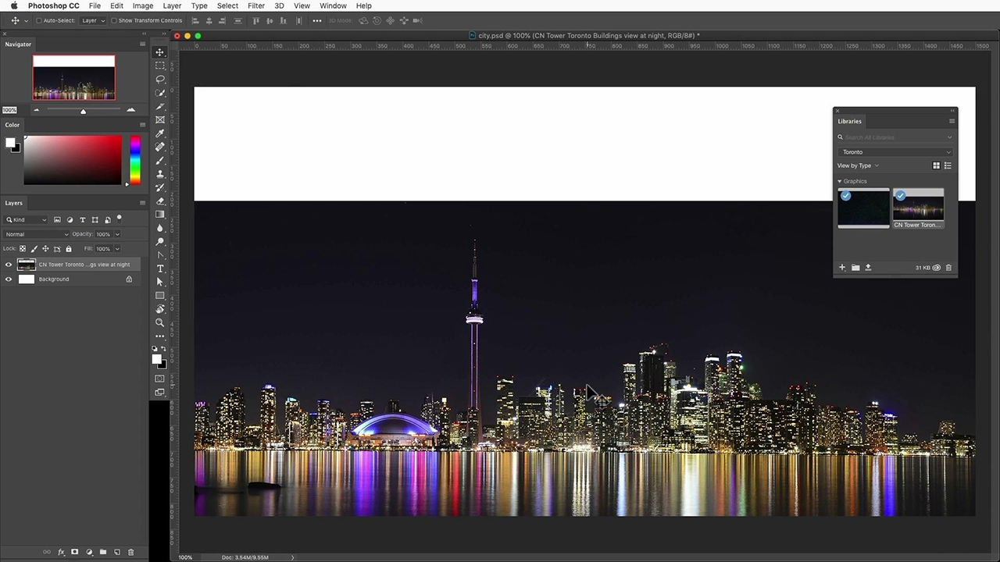
      </a>
      

      <a href="webgraphics.md"><strong>Create engaging web graphics by combining Adobe Stock images with CSS</strong></a>
      

      <em>Create brand unity with varying images by combining colors and gradients across your advertising campaign</em>
       
  </td>
</tr>
<tr>
   <td>
      <a href="moodboard.md">
         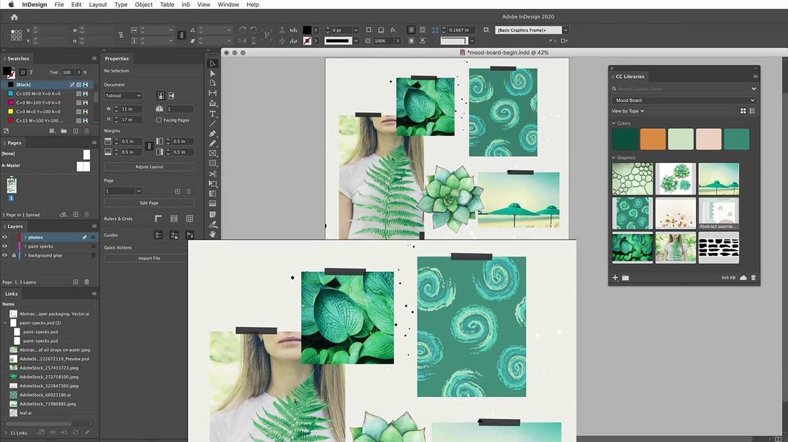
      </a>
      

      <a href="moodboard.md"><strong>Create inspiring mood boards in no time with Adobe Stock</strong></a>
      

      <em>Create a project mood board to relay information, ideas, visuals, and color palettes to teams/clients</em>
       
  </td>
  <td>
      <a href="realisticcomposite.md">
         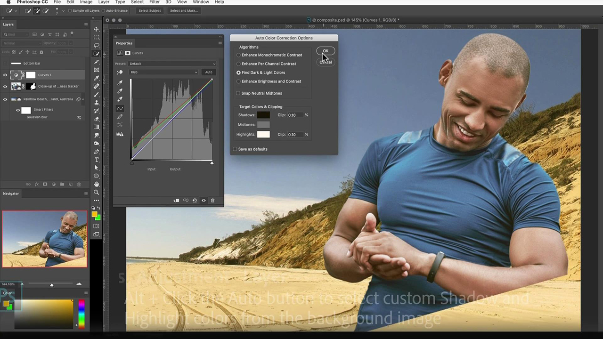
      </a>
      

      <a href="realisticcomposite.md"><strong>Create realistic photo composites with Adobe Stock images</strong></a>
      

      <em>Bring together two great Adobe Stock photos to draw people into your social posts</em>
       
  </td>
   <td>
   <a href="loadingscreen.md">
      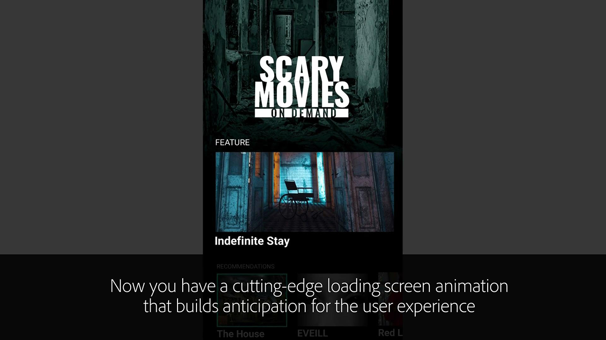
   </a>
    

   <a href="loadingscreen.md"><strong>Customize a loading screen animation with Adobe Stock and XD</strong></a>
    

    <em>Customize vector artwork from Adobe Stock to create a chilling loading screen animation for a mobile app</em>
     
  </td>
</tr>
<tr>
   <td>
   
    

   <a href="presentationtemplate.md"><strong>Customize an Adobe Stock presentation template to look professional, yet eye-catching</strong></a>
    

    <em>Create a beautiful stylized presentation in minutes with images and templates from Adobe Stock and some easy-to-do special effects</em>
     
  </td>
   <td>
   <a href="customizecolors.md">
      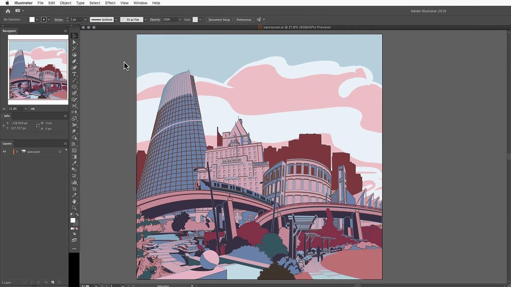
   </a>
    

   <a href="customizecolors.md"><strong>Customize the colors in an Adobe Stock vector illustration</strong></a>
    

    <em>Add polish to any project with a great-looking illustration. Find the perfect vector in Adobe Stock, and then match the colors to your project's palette using Adobe Illustrator</em>
     
  </td>
   <td>
      
      

      <a href="assets/AddMotiontoStillImageswithAdobeStockandPhotoshop.pdf"><strong>Add motion to still images with Adobe Stock and Photoshop (PDF)</strong></a>
      

      <em>Wow your audiences on any screen by incorporating video into a still image</em>
       
   </td>
</tr>
<tr>
   <td>
   
    

   <a href="assets/CreateacompositewithPhotoshopontheiPadandAdobeStockimages.pdf"><strong>Create a composite with Photoshop on the iPad and Adobe Stock images (PDF)</strong></a>
    

    <em>Learn to use one of your favorite Adobe Creative Cloud apps in a whole new way with the power of Photoshop on your iPad</em>
     
  </td>
   <td>
   
    

   <a href="assets/CreateaUniqueEditorialGraphicwithAfterEffectsandAdobeStock.pdf"><strong>Animate an Adobe Stock vector illustration in Photoshop (PDF)</strong></a>
    

    <em>By combining After Effects with Adobe Stock, you can quickly create stunning special effects that will help you visually tell a story</em>
     
  </td>
   <td>
      
      

      <a href="assets/CreateUniqueGraphicsbyCombiningAdobeStockImages.pdf"><strong>Create unique graphics by combining Adobe Stock images (PDF)</strong></a>
      

      <em>Bring together two different images to create an entirely new scene for your design projects. Adobe Stock and Adobe Photoshop make it easy</em>
       
   </td>
</tr>
<tr>
   <td>
      
      

      <a href="assets/CreatingaHalloweenCinemagraphwithPhotoshopCCandAdobeStock.pdf"><strong>Creating a Halloween cinemagraph with Photoshop CC and Adobe Stock (PDF)</strong></a>
      

      <em>Create a cinemagraph by compositing video, illustrations, and photos with Adobe Photoshop</em>
       
  </td>
   <td>
      
      

      <a href="assets/PutyourDatainMotionwithAdobeStockandPremierePro.pdf"><strong>Put your data in motion with Adobe Stock and Premiere Pro (PDF)</strong></a>
      

      <em>Make your data come to life to tell a more persuasive story using Adobe Stock and Adobe Premiere Pro</em>
       
  </td>
   <td>
      
      

      <a href="assets/RecolorAdobeStockVectorArtworkwithAdobeIllustratortoGetExactlytheLookYouWant.pdf"><strong>Recolor Adobe Stock vector artwork with Adobe Illustrator to get exactly the look you want (PDF)</strong></a>
      

      <em>Adobe Stock makes it easy to find unique vector graphics, and Adobe Illustrator enables you to quickly modify them to match your creative vision</em>
       
   </td>
 </tr> 
 <tr>
   <td>
      
      

      <a href="assets/ShowOffyourDesignWorkintheRealWorldwithAdobeStockandPhotoshop.pdf"><strong>Show off your design work in the real world with Adobe Stock and Photoshop (PDF)</strong></a>
      

      <em>Follow these steps to showcase your work in a realistic-looking Adobe Stock template using Adobe Photoshop</em>
       
  </td>
   <td>
      
      

      <a href="assets/UncoveramazingdetailsinAdobeStockimageswithLightroomformobile.pdf"><strong>Uncover amazing details in Adobe Stock images with Lightroom for mobile (PDF)</strong></a>
      

      <em>Discover the power of Lightroom on your mobile device to bring out the best in your images</em>
       
  </td>
   <td>
      
      

      <a href="assets/VisualizePosterDesignsintheRealWorldwithAdobeStockandPhotoshop.pdf"><strong>Visualize poster designs in the real world with Adobe Stock and Photoshop (PDF)</strong></a>
      

      <em>Showcase your designs in real-life environments to get a better sense of how they’ll look out in the world</em>
       
  </td>
</tr>
</table>
