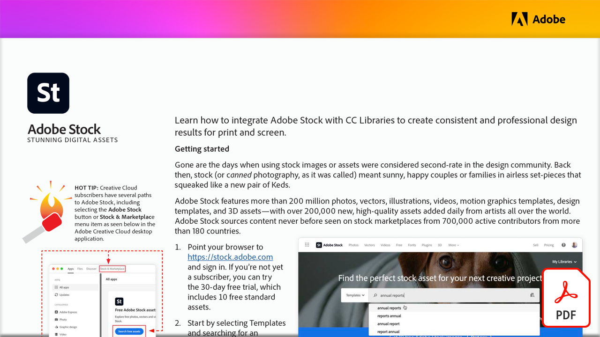

# Stunning digital assets

Learn how to integrate Adobe Stock with CC Libraries to create consistent and professional design results for print and screen in this hands-on tutorial.

Select the image below to view or download this PDF tutorial.

[{"width=680"}](assets/Stunning-Digital-Assets.pdf){target="blank"}

>[!NOTE]
>
>Adobe Stock assets that are saved to CC Libraries can be seamlessly added into Microsoft PowerPoint and Word. Instructions on how to download and install the Adobe Creative Cloud add-in can be found [here](https://helpx.adobe.com/creative-cloud/help/libraries-addin-microsoft-office.html) or in the Microsoft App Store. The process is simple for both apps, particularly for those with experience using Adobe Stock in Illustrator, InDesign, or Photoshop. For more information visit [Explore Adobe Stock integrated plug-ins in Microsoft Office 365](https://helpx.adobe.com/stock/help/microsoft-office-plug-ins.html).
